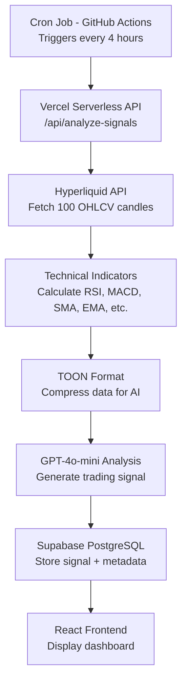

# Aurum

> AI-Powered Cryptocurrency Trading Signal Generator

[](https://aurum.vercel.app)
[](https://www.typescriptlang.org/)
[](https://reactjs.org/)
[](https://openai.com/)
[](LICENSE)

Aurum is an automated trading signal generator that combines technical analysis with artificial intelligence to produce cryptocurrency trading recommendations every 4 hours. The system analyzes OHLCV data from Hyperliquid, calculates multiple technical indicators, and uses OpenAI's GPT-4o-mini to generate actionable trading signals with entry points, stop losses, and take profit targets.

**[View Documentation](CLAUDE.md)** • **[API Reference](#api-reference)** • **[Contributing](#contributing)**

---

## Table of Contents

- [Features](#features)
- [Architecture](#architecture)
- [Technology Stack](#technology-stack)
- [Installation](#installation)
- [Configuration](#configuration)
- [Usage](#usage)
- [API Reference](#api-reference)
- [Monitoring](#monitoring)
- [Development](#development)
- [Cost Analysis](#cost-analysis)
- [Contributing](#contributing)
- [License](#license)

---

## Features

### Automation
- Fully automated signal generation every 4 hours
- Serverless architecture requiring zero manual intervention
- GitHub Actions-based scheduling at no cost

### Technical Analysis
- Eight technical indicators: SMA, EMA, RSI, MACD, Bollinger Bands, Stochastic, Parabolic SAR, ATR
- TOON format compression for efficient AI processing
- Historical signal storage for backtesting

### AI Integration
- GPT-4o-mini for intelligent signal analysis
- Confidence scoring (0-100%)
- Detailed reasoning for each recommendation

### Economic Efficiency
- Total monthly cost: ~$1-2 USD
- Free tier services for infrastructure
- No server maintenance required

---

## Architecture



### Data Flow

| Step | Component | Action | Output |
|:----:|-----------|--------|--------|
| 1 | Cron Scheduler | Triggers API endpoint every 4 hours | HTTP POST request |
| 2 | Hyperliquid API | Fetches historical price data | 100 OHLCV candles |
| 3 | Indicator Engine | Calculates technical metrics | RSI, MACD, SMA, EMA values |
| 4 | TOON Formatter | Compresses data for AI context | Optimized JSON payload |
| 5 | GPT-4o-mini | Analyzes indicators and patterns | Trading signal + reasoning |
| 6 | Database | Persists signal with metadata | Entry, SL, TP prices stored |
| 7 | Frontend | Retrieves and displays signals | Real-time dashboard update |

---

## Technology Stack

### Frontend
- **Framework**: React 18 with TypeScript
- **Styling**: Tailwind CSS with custom design system
- **UI Library**: Tremor React components
- **Build Tool**: Vite

### Backend
- **Runtime**: Vercel Serverless Functions
- **Database**: Supabase (PostgreSQL)
- **AI Provider**: OpenAI (GPT-4o-mini)
- **Data Source**: Hyperliquid REST API

### Infrastructure
- **Hosting**: Vercel (free tier)
- **Scheduling**: GitHub Actions (free tier)
- **Database**: Supabase (free tier)
- **CI/CD**: Automated via GitHub integration

---

## Installation

### Prerequisites

- Node.js 18 or higher
- Supabase account (free tier)
- Vercel account (free tier)
- OpenAI API key with credits
- GitHub account for automated scheduling

### Quick Start

```bash
# Clone repository
git clone https://github.com/your-username/aurum.git
cd aurum

# Install dependencies
npm install

# Configure environment variables (see Configuration section)
cp .env.example .env

# Run development server
npm run dev              # Frontend only (port 5173)
vercel dev               # Full stack with API (port 3000)
```

---

## Configuration

### 1. Supabase Setup

**Create Database Tables**:

1. Create a new project at [supabase.com](https://supabase.com)
2. Execute `supabase/schema.sql` in SQL Editor (candles table)
3. Execute `supabase/schema-signals.sql` (trading signals table)

**Configure Row Level Security**:

```sql
-- Enable RLS
ALTER TABLE btc_trading_signals ENABLE ROW LEVEL SECURITY;

-- Allow public read access
CREATE POLICY "signals_select" ON btc_trading_signals
  FOR SELECT USING (true);
```

**Obtain Credentials**:
- Navigate to Settings → API
- Copy `Project URL` → `SUPABASE_URL`
- Copy `anon public` key → `SUPABASE_ANON_KEY`
- Copy `service_role` key → `SUPABASE_SERVICE_ROLE_KEY`

### 2. OpenAI API Setup

1. Visit [platform.openai.com](https://platform.openai.com/api-keys)
2. Generate new API key
3. Add credits to your account (pay-as-you-go)
4. Copy key → `OPENAI_API_KEY`

### 3. Environment Variables

**Local Development** (`.env`):

```bash
# Frontend variables
VITE_SUPABASE_URL=https://your-project.supabase.co
VITE_SUPABASE_ANON_KEY=your-anon-key

# Backend variables
SUPABASE_URL=https://your-project.supabase.co
SUPABASE_SERVICE_ROLE_KEY=your-service-role-key
OPENAI_API_KEY=sk-proj-your-api-key
```

**Production** (Vercel Dashboard):

Add all five variables in Project Settings → Environment Variables:
- `VITE_SUPABASE_URL`
- `VITE_SUPABASE_ANON_KEY`
- `SUPABASE_URL`
- `SUPABASE_SERVICE_ROLE_KEY`
- `OPENAI_API_KEY`

### 4. Automated Scheduling

**GitHub Actions Configuration**:

Create `.github/workflows/trading-signals.yml`:

```yaml
name: Generate Trading Signals

on:
  schedule:
    - cron: '0 */4 * * *'  # Every 4 hours at 00:00, 04:00, 08:00, 12:00, 16:00, 20:00 UTC
  workflow_dispatch:        # Allow manual triggering

jobs:
  analyze:
    runs-on: ubuntu-latest
    steps:
      - name: Trigger Signal Analysis
        run: |
          curl -X POST https://your-app.vercel.app/api/analyze-signals \
            -H "Content-Type: application/json" \
            -d '{"symbols": ["BTC"], "interval": "4h", "limit": 100}'
```

Commit and push to enable automated execution.

---

## Usage

### Supported Cryptocurrencies

`BTC`

### Signal Classification

| Signal Type | Description | Typical Conditions |
|-------------|-------------|-------------------|
| **STRONG_BUY** | High confidence buy recommendation | RSI < 30, bullish MACD crossover, price above SMA |
| **BUY** | Moderate buy recommendation | RSI < 50, price above SMA 20 |
| **HOLD** | No clear directional bias | Mixed indicators, neutral RSI |
| **SELL** | Moderate sell recommendation | RSI > 50, price below SMA 20 |
| **STRONG_SELL** | High confidence sell recommendation | RSI > 70, bearish MACD crossover, price below SMA |

### Technical Indicators

- **SMA (20, 50)**: Simple Moving Average - trend identification
- **EMA (12, 26)**: Exponential Moving Average - momentum analysis
- **RSI (14)**: Relative Strength Index - overbought/oversold conditions
- **MACD**: Moving Average Convergence Divergence - trend reversals
- **Bollinger Bands**: Volatility measurement
- **Stochastic Oscillator**: Momentum indicator
- **Parabolic SAR**: Trend direction and reversal points
- **ATR**: Average True Range - volatility measurement

---

## API Reference

### POST /api/analyze-signals

**Description**: Executes the complete analysis pipeline from data fetching to signal generation.

**Request Body**:

```json
{
  "symbols": ["BTC", "ETH", "SOL"],
  "interval": "4h",
  "limit": 100
}
```

**Parameters**:
- `symbols` (string[]): Array of cryptocurrency symbols
- `interval` (string): Candle interval (1m, 5m, 15m, 1h, 4h, 1d)
- `limit` (number): Number of candles to analyze (1-500, recommended: 100)

**Success Response** (200):

```json
{
  "success": true,
  "signals": [
    {
      "symbol": "BTC",
      "interval": "4h",
      "signal": "BUY",
      "confidence": 75.5,
      "entry_price": 42500,
      "stop_loss": 41000,
      "take_profit": 45000,
      "ai_reasoning": "Strong uptrend with RSI not overbought. MACD shows bullish momentum with recent crossover.",
      "ai_model": "gpt-4o-mini",
      "processing_time_ms": 3450
    }
  ],
  "processing_time_ms": 5200
}
```

**Error Response** (400/500):

```json
{
  "error": "Error description message"
}
```

---

## Monitoring

### GitHub Actions
- **Location**: Repository → Actions → "Generate Trading Signals"
- **Metrics**: Execution history, timestamps, success/failure status
- **Logs**: Detailed output for each cron job execution

### Vercel Functions
- **Location**: Vercel Dashboard → Project → Functions
- **Metrics**: Response times, invocation counts, error rates
- **Logs**: Real-time streaming logs with request/response data

### Supabase Dashboard
- **Location**: Supabase Dashboard → Table Editor
- **Tables**: `btc_trading_signals` for signal history
- **Queries**: SQL editor for custom analytics

**Example Queries**:

```sql
-- Latest 20 signals
SELECT * FROM btc_trading_signals
ORDER BY created_at DESC
LIMIT 20;

-- Signal distribution
SELECT signal, COUNT(*) as count
FROM btc_trading_signals
GROUP BY signal
ORDER BY count DESC;

-- Average confidence by signal type
SELECT signal, AVG(confidence) as avg_confidence
FROM btc_trading_signals
GROUP BY signal;
```

---

## Development

### Build Commands

```bash
# Development
npm run dev              # Start Vite dev server
vercel dev               # Start local serverless environment

# Production
npm run build            # Build for production
npm run preview          # Preview production build

# Quality
npm run lint             # Run ESLint
npm run typecheck        # TypeScript type checking
```

### Project Structure

```
aurum/
├── api/
│   └── analyze-signals.ts           # Main AI analysis pipeline
├── src/
│   ├── components/
│   │   ├── TradingSignalCard.tsx    # Latest signal display
│   │   ├── SignalsHistoryTable.tsx  # Historical signals table
│   │   └── ToonViewer.tsx           # Debug data viewer
│   ├── layouts/
│   │   └── AppLayout.tsx            # Application shell
│   ├── services/
│   │   ├── signals.ts               # Database queries
│   │   ├── indicators.ts            # Technical calculations
│   │   └── hyperliquid.ts           # Market data API
│   ├── lib/
│   │   ├── supabase.ts              # Database client
│   │   └── styles.ts                # Design system tokens
│   ├── types/
│   │   └── database.ts              # TypeScript definitions
│   └── utils/
│       └── supabase-error.ts        # Error handling
├── supabase/
│   ├── schema.sql                   # Candles table schema
│   └── schema-signals.sql           # Signals table schema
└── .github/workflows/
    └── trading-signals.yml          # Automated scheduling
```

### Design System

The project uses a centralized design system (`src/lib/styles.ts`):

- **SPACING**: Margin, padding, gap utilities
- **LAYOUT**: Container widths, page padding
- **TYPOGRAPHY**: Text sizes and styles
- **COLORS**: Semantic color tokens with dark mode support
- **COMPONENTS**: Reusable component styles

---

## Cost Analysis

### Monthly Breakdown

| Service | Tier | Monthly Cost |
|---------|------|--------------|
| Supabase | Free (500MB database) | $0.00 |
| Vercel | Hobby (Serverless functions) | $0.00 |
| GitHub Actions | Free (2000 minutes) | $0.00 |
| OpenAI API | Pay-as-you-go | $0.10 - $0.50 |
| **Total** | | **$0.10 - $0.50** |

### Usage Calculation

- Executions per day: 6 (every 4 hours)
- Monthly executions: 180 (6 × 30 days)
- Symbols per execution: 1 (BTC)
- Total AI requests: 180/month
- GPT-4o-mini pricing: $0.150/1M input tokens, $0.600/1M output tokens
- Average tokens per request: ~2000 input + 500 output
- Cost per request: ~$0.0006
- Estimated monthly total: $0.10-$0.50 USD

---

## Contributing

Contributions are welcome. Please follow these guidelines:

1. Fork the repository
2. Create a feature branch: `git checkout -b feature/description`
3. Commit changes: `git commit -m 'Add feature description'`
4. Push to branch: `git push origin feature/description`
5. Submit a Pull Request

### Development Areas

- **AI Optimization**: Improve prompts for better signal accuracy
- **Technical Indicators**: Implement additional TA metrics
- **Backtesting**: Build historical performance analysis
- **Notifications**: Email/Telegram alerts for high-confidence signals
- **UI/UX**: Enhanced data visualization
- **Documentation**: Expand guides and tutorials

### Code Standards

- Follow TypeScript strict mode
- Use ESLint configuration
- Write descriptive commit messages
- Add JSDoc comments for complex functions
- Include tests for new features

---

## Disclaimer

**IMPORTANT**: This software is provided for educational and research purposes only. The trading signals generated by this system do not constitute financial advice. Cryptocurrency trading involves substantial risk of loss. Users should conduct their own research (DYOR) and consult with qualified financial advisors before making investment decisions. The authors and contributors assume no liability for financial losses incurred through use of this software.

---

## License

This project is licensed under the MIT License. See [LICENSE](LICENSE) file for details.

**Commercial Use**: Permitted under MIT License terms.
**Attribution**: Required as per MIT License.
**Warranty**: None. Software provided "as-is".

---

## Acknowledgments

- **[OpenAI](https://openai.com)**: GPT-4o-mini language model
- **[Hyperliquid](https://hyperliquid.xyz)**: Cryptocurrency market data API
- **[Supabase](https://supabase.com)**: PostgreSQL database platform
- **[Vercel](https://vercel.com)**: Serverless deployment platform
- **[Tremor](https://tremor.so)**: React UI component library
- **[indicatorts](https://github.com/cinar/indicatorts)**: Technical indicator calculations

---

**Documentation**: [CLAUDE.md](CLAUDE.md) | **Issues**: [GitHub Issues](https://github.com/your-username/aurum/issues) | **Discussions**: [GitHub Discussions](https://github.com/your-username/aurum/discussions)

