<div align="center">

# Aurum

**Autonomous cryptocurrency trading powered by AI signal analysis**

An automated trading system that combines technical analysis with AI reasoning to generate, validate, and execute trades on Hyperliquid DEX.

[](https://nextjs.org/)
[](https://www.typescriptlang.org/)
[](https://tailwindcss.com/)

[Features](#key-features) • [Architecture](#how-it-works) • [Quick Start](#quick-start) • [Tech Stack](#tech-stack)

</div>


## What is Aurum?

Aurum is a full-stack trading platform that automates the complete trading lifecycle: from market data analysis to order execution and position management.

**The Problem:** Manual trading requires constant monitoring, quick decision-making under pressure, and consistent risk management discipline. Most traders struggle with emotional decisions and lack systematic approaches.

**The Solution:** Aurum combines quantitative technical analysis with AI-powered reasoning to:
- Fetch and analyze market data from Hyperliquid DEX
- Calculate 8+ technical indicators (RSI, MACD, Bollinger Bands, ATR, etc.)
- Generate trading signals using Cerebras AI with risk-reward validation
- Automatically execute trades with pre-configured stop-loss and take-profit levels
- Track positions in real-time with visual performance dashboards

Built for **testnet experimentation**, Aurum provides a safe environment to develop and refine algorithmic trading strategies without financial risk.


## Key Features

### 🤖 AI-Powered Signal Generation
Cerebras z.ai-glm-4.6 analyzes market data compressed in TOON format, generating actionable trading signals with confidence scores. Each signal includes entry price, stop-loss, and take-profit levels calculated using ATR (Average True Range) multipliers for dynamic risk management.

### 📊 Comprehensive Technical Analysis
8 technical indicators calculated per analysis cycle:
- **Trend**: SMA (21/50/100), EMA (12/21/55), Parabolic SAR
- **Momentum**: RSI (14/21), MACD (crypto-optimized 8/17/9)
- **Volatility**: Bollinger Bands, ATR
- **Oscillator**: Stochastic (14/3)

### ⚡ Automated Trade Execution
Auto-trading system executes signals meeting confidence thresholds (≥60% by default). Position sizing uses risk-based formula: **2% of account balance per trade**, automatically calculating optimal position size based on stop-loss distance.

### 🛡️ Multi-Layer Validation
Three-stage validation pipeline ensures trade quality:
1. **Schema validation** (Zod) - Type safety and data integrity
2. **Business logic** - Price relationships, R:R ratio checks (minimum 3:1)
3. **Risk checks** - Balance verification, position conflicts, psychological price levels

### 📈 Real-Time Position Tracking
Live dashboard with visual roadmaps showing:
- Current P&L with percentage and dollar amounts
- Stop-loss and take-profit levels on interactive charts
- Risk/reward ratios with proportional visual representation
- Multi-position support with isolated order filtering

### 🔒 Security-First Architecture
- **Vault separation**: API wallet signs transactions, vault holds funds
- **Row-Level Security**: Frontend has read-only database access
- **Environment isolation**: Public vs server-only variable separation
- **Testnet-only deployment**: Zero mainnet exposure for safe experimentation


## How It Works

```mermaid
graph LR
    A[📅 Scheduled Trigger] --> B[📊 Fetch Market Data<br/>Hyperliquid API]
    B --> C[🧮 Calculate Indicators<br/>SMA, RSI, MACD, ATR]
    C --> D[🤖 AI Analysis<br/>Cerebras z.ai-glm-4.6]
    D --> E{Validate Signal}
    E -->|Valid| F[💾 Store in Database<br/>Supabase PostgreSQL]
    E -->|Invalid| X[❌ Reject]
    F --> G{Auto-trade<br/>Enabled?}
    G -->|Yes & Confidence ≥60%| H[⚡ Execute Trade<br/>Hyperliquid DEX]
    G -->|No| I[📈 Display Dashboard]
    H --> I

    style A fill:#2d3748,stroke:#4a5568,stroke-width:2px,color:#fff
    style B fill:#2c5282,stroke:#3182ce,stroke-width:2px,color:#fff
    style C fill:#2c5282,stroke:#3182ce,stroke-width:2px,color:#fff
    style D fill:#553c9a,stroke:#805ad5,stroke-width:2px,color:#fff
    style E fill:#744210,stroke:#d69e2e,stroke-width:2px,color:#fff
    style F fill:#22543d,stroke:#38a169,stroke-width:2px,color:#fff
    style G fill:#744210,stroke:#d69e2e,stroke-width:2px,color:#fff
    style H fill:#9c4221,stroke:#dd6b20,stroke-width:2px,color:#fff
    style I fill:#22543d,stroke:#38a169,stroke-width:2px,color:#fff
    style X fill:#742a2a,stroke:#e53e3e,stroke-width:2px,color:#fff
```



### The Complete Flow

The system operates in a continuous cycle triggered by scheduled cron jobs:

**1. Data Collection**
Hyperliquid REST API provides OHLCV candlestick data via the `/info` endpoint. Each candle contains open, high, low, close, volume, and trade count. Data is validated with Zod schemas and upserted to PostgreSQL to prevent duplicates.

**2. Technical Analysis**
The `indicatorts` library processes 100 candles to calculate trend (SMA, EMA), momentum (RSI, MACD), volatility (Bollinger Bands, ATR), and oscillator (Stochastic) indicators. These provide quantitative market context for AI analysis.

**3. AI Signal Generation**
Market data is compressed using TOON format (optimized for LLM consumption) and sent to Cerebras z.ai-glm-4.6. The AI analyzes patterns, calculates entry/SL/TP prices using ATR multipliers, and returns a structured JSON signal with confidence score and reasoning.

**4. Validation Pipeline**
Signals pass through three validation layers:
- **Schema**: Zod validates data types and ranges
- **Business Logic**: Checks price relationships (BUY: SL < Entry < TP) and R:R ratios
- **Risk Management**: Verifies balance, existing positions, and confidence thresholds

**5. Auto-Execution (Optional)**
If enabled and confidence ≥60%, the system calculates position size (2% account risk), rounds BTC prices to whole numbers, and executes a 3-order sequence on Hyperliquid: LIMIT entry + Stop Loss trigger + Take Profit trigger.

**6. Real-Time Monitoring**
Frontend dashboards display signal history (via Supabase read-only client) and live positions (via Hyperliquid SDK). Position roadmaps visualize current P&L, SL/TP levels, and R:R ratios with auto-refresh polling.


## Architecture Decisions

### Why Cerebras z.ai-glm-4.6?
High-speed inference enables sub-second signal generation, critical for time-sensitive trading decisions. TOON compression reduces token usage by ~40% compared to raw JSON.

### Why Hyperliquid?
Decentralized perpetuals exchange with native testnet support. REST API provides order book access without requiring blockchain nodes. Vault architecture enables secure delegated trading.

### Why Three-Order Execution?
Hyperliquid testnet requires separate orders for entry, SL, and TP (no native bracket orders). `reduce_only` flags on SL/TP prevent over-leveraging and ensure orders only close positions.

### Why Supabase?
Provides auto-generated REST API from PostgreSQL schema, eliminating the need to write custom CRUD endpoints. Client SDK simplifies database operations with TypeScript type safety. Built-in Row-Level Security (RLS) enables secure frontend queries without exposing service credentials or building authentication middleware.


## Tech Stack

<div align="center">

| Layer | Technology | Purpose |
|-------|-----------|---------|
| **Frontend** | Next.js 15 + React 19 | Server/Client Components, App Router |
| **Styling** | Tailwind CSS v4 + shadcn/ui | Utility-first CSS + accessible components |
| **Database** | Supabase PostgreSQL | Auto-REST API, Row-Level Security |
| **AI** | Cerebras z.ai-glm-4.6 | High-speed inference + TOON compression |
| **Trading** | Hyperliquid SDK | DEX integration (testnet) |
| **Indicators** | indicatorts | Pure TypeScript technical analysis |
| **Validation** | Zod | Runtime type safety + schema validation |

</div>


## Quick Start

### Prerequisites

- **Node.js** 18+ and **pnpm** installed
- **Supabase** account with PostgreSQL database
- **Cerebras API** key ([Get one here](https://cloud.cerebras.ai))
- **Hyperliquid testnet** wallet ([Setup guide](https://app.hyperliquid.xyz/))

### Installation

```bash
# Clone the repository
git clone https://github.com/yourusername/aurum.git
cd aurum

# Install dependencies
pnpm install
```

### Configuration

Create `.env.local` file with required credentials:

```env
# Supabase (Database)
NEXT_PUBLIC_SUPABASE_URL=https://your-project.supabase.co
NEXT_PUBLIC_SUPABASE_ANON_KEY=your-anon-key
SUPABASE_SERVICE_ROLE_KEY=your-service-role-key

# Cerebras AI
CEREBRAS_API_KEY=your-cerebras-api-key

# Hyperliquid Trading (Testnet)
HYPERLIQUID_API_WALLET_PRIVATE_KEY=0x...
HYPERLIQUID_WALLET_ADDRESS=0x...
HYPERLIQUID_TESTNET=true

# Optional: Cron job security
CRON_SECRET=your-random-secret
```

### Database Setup

Run the SQL migrations in your Supabase dashboard:

```sql
-- Create tables (see schema in /supabase/migrations)
-- Enable Row-Level Security policies
-- Configure read-only access for anon key
```

### Running Locally

```bash
# Development server
pnpm dev
# → http://localhost:3000

# Type checking
pnpm type-check

# Build for production
pnpm build
pnpm start
```

### Testing Trading

Test order execution on Hyperliquid testnet:

```bash
npx tsx scripts/test-limit-order.ts
# Expected output:
# ✅ Entry order placed
# ✅ Stop Loss trigger set
# ✅ Take Profit trigger set
```

### Disable Auto-Trading

To generate signals without executing trades:

```typescript
// lib/api/constants.ts
export const TRADING_CONFIG = {
  AUTO_TRADE_ENABLED: false,  // Set to false
  // ...
}
```


## API Reference

### POST /api/analyze-signals

Generates AI trading signals with technical analysis.

```bash
curl -X POST http://localhost:3000/api/analyze-signals \
  -H "Content-Type: application/json" \
  -d '{"symbol": "BTC", "interval": "4h", "limit": 100}'
```

**Response:**
```json
{
  "success": true,
  "signal": {
    "signal": "BUY",
    "confidence": 75,
    "entry_price": 88000,
    "stop_loss": 87000,
    "take_profit": 90000,
    "reasoning": "Strong uptrend with RSI confirmation"
  },
  "trade": {
    "success": true,
    "entryOrder": { "oid": 123456 },
    "slSuccess": true,
    "tpSuccess": true
  }
}
```

### POST /api/trade

Execute manual trades on Hyperliquid.

```bash
curl -X POST http://localhost:3000/api/trade \
  -H "Content-Type: application/json" \
  -d '{
    "action": "OPEN",
    "symbol": "BTC",
    "signal": "BUY",
    "orderType": "LIMIT",
    "entryPrice": 88000,
    "stopLoss": 87000,
    "takeProfit": 90000,
    "size": 0.001
  }'
```

### GET /api/trade

Retrieve account information and open positions.

```bash
curl http://localhost:3000/api/trade
```

**Response:**
```json
{
  "accountBalance": 1000,
  "positions": [
    {
      "symbol": "BTC",
      "size": 0.001,
      "entryPrice": 88000,
      "unrealizedPnl": 50,
      "leverage": 1
    }
  ],
  "openOrders": [...]
}
```

---

## Configuration

### Risk Management

Customize trading parameters in `lib/api/constants.ts`:

```typescript
export const TRADING_CONFIG = {
  AUTO_TRADE_ENABLED: true,        // Enable/disable auto-trading
  MIN_CONFIDENCE_TO_TRADE: 60,     // Minimum AI confidence (%)
  RISK_PERCENTAGE: 2,              // Risk per trade (% of balance)
  MIN_POSITION_VALUE_USD: 10,      // Minimum position size
  DEFAULT_LEVERAGE: 1,             // Leverage multiplier
}
```

### AI Settings

```typescript
export const AI_CONFIG = {
  TEMPERATURE: 1,                  // Randomness (0-2)
  MAX_TOKENS: 8000,                // Max response length
  MIN_RR_RATIO: 3.0,              // Minimum reward:risk ratio
  MODEL: 'zai-glm-4.6',           // Cerebras model
}
```

### ATR Multipliers

```typescript
export const ATR_CONFIG = {
  MULTIPLIER_SL: 1.75,            // Stop Loss distance
  MULTIPLIER_TP: 3.5,             // Take Profit distance
}
```


## Disclaimer

⚠️ **This software is for educational and experimental purposes only.**

- **Testnet Only**: All trading occurs on Hyperliquid testnet with no real funds.
- **No Financial Advice**: Signals generated are algorithmic outputs, not investment recommendations.
- **Use at Your Own Risk**: Cryptocurrency trading involves substantial risk of loss.
- **No Warranty**: Software provided "as-is" without guarantees of accuracy or profitability.

Never deploy to mainnet without thorough testing, understanding of risks, and proper capital management.

---

## License

MIT License - see [LICENSE](LICENSE) file for details.

---

<div align="center">

**Built with** [Next.js](https://nextjs.org/) • [Tailwind CSS](https://tailwindcss.com/) • [shadcn/ui](https://ui.shadcn.com/) • [Hyperliquid](https://hyperliquid.xyz/)

Made with ⚡ by developers, for developers

</div>
